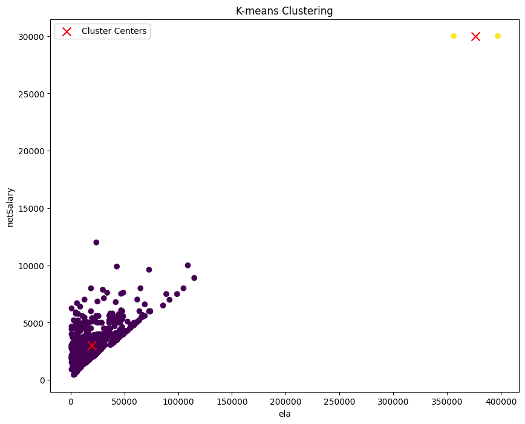
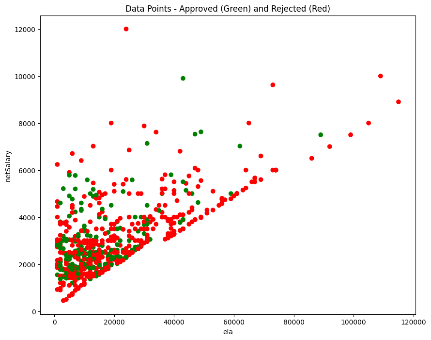
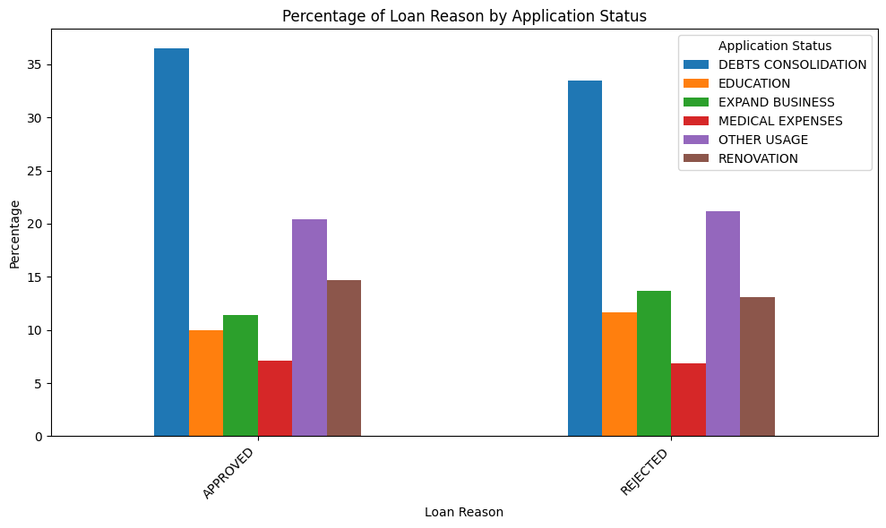
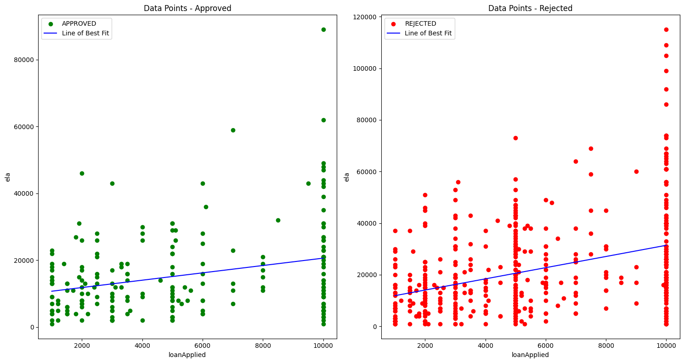
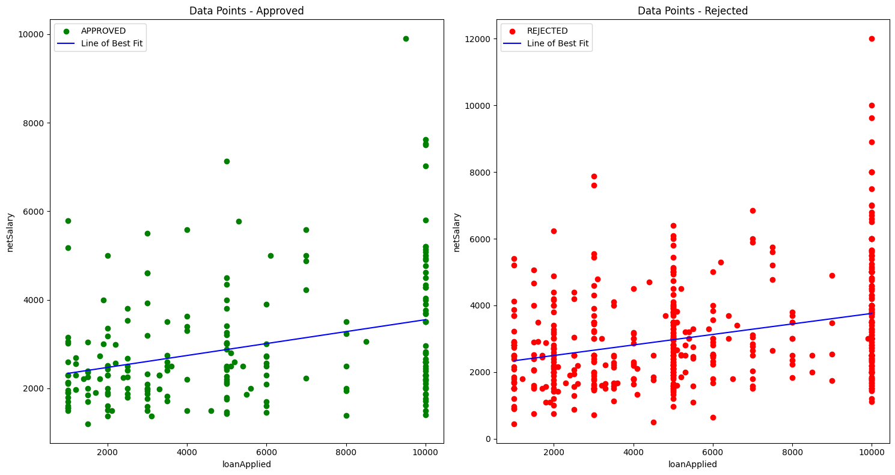
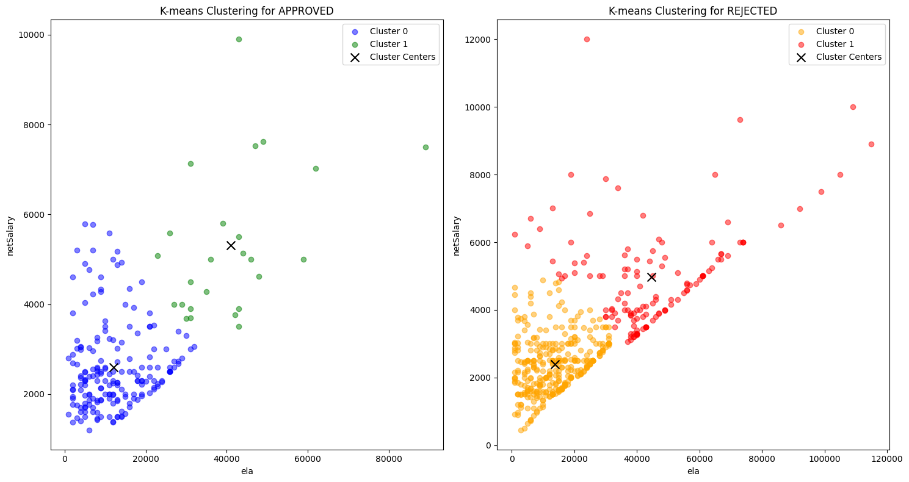
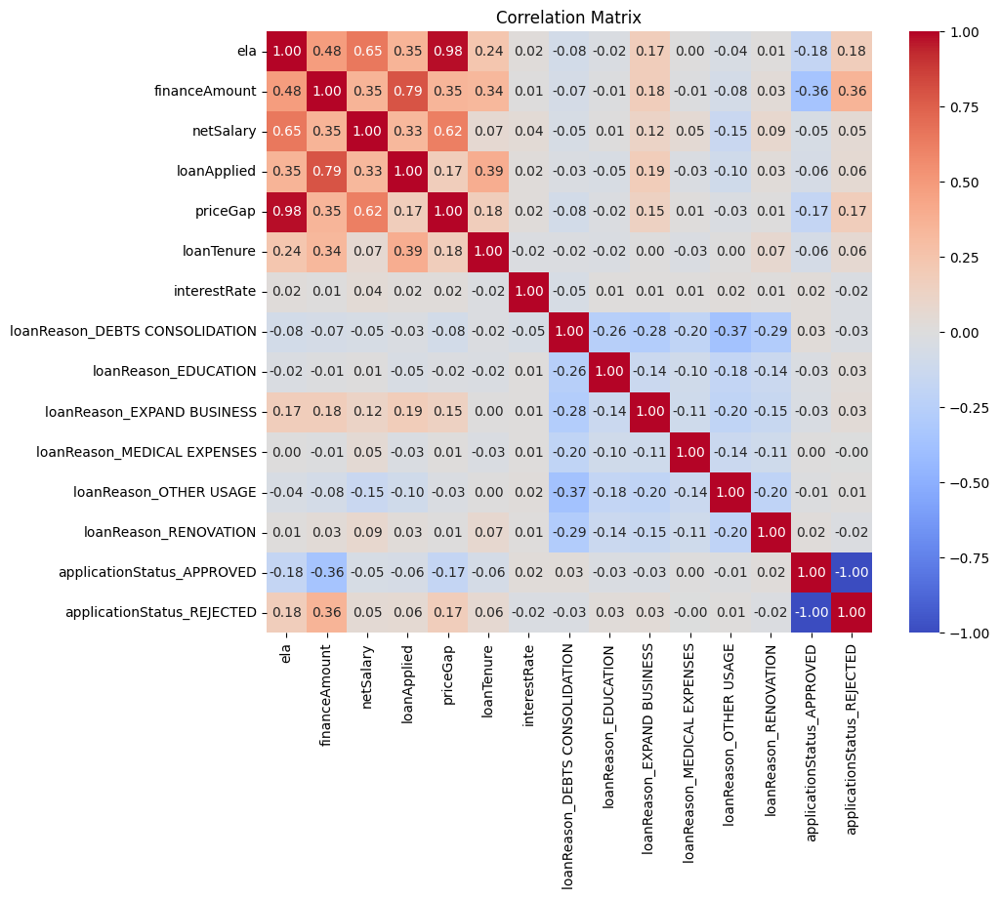

# Arkmind AI Engineer Technical Assessment 1
This repository is a Technical Assessment for Arkmind AI Engineer

## Overview
1. assessment.ipynb
    - Technical assesment contents were completed here
2. models
    - Multiple Fine-tuned models 
3. data.csv
    - The dataset provided.
4. requirements.txt

## Approach
1. Data Understanding
    - Load data 
    - Visualize data 
        - 0 Duplicated IDs
        - 61 rows of null on ela and financeAmount
        - 230 rows of 0 values in ela and financeAmount
        - 2 Outliers within netSalary and ela

        

2. Data Preprocessing
    - Drop data rows with NaN and 0 values.
    - Remove outliers
    - Drop unnecessary columns.
    - Only 707 rows left
    - Feature Engineering
        - Create new column based off the difference between ela & loanApplied
    - Split training and test data.

3. Feature Understanding
    - Created graphs to better understand the data.
    - Scatter Plot of Approved and Rejected Applicants based off netSalary & ela

    

    - Bar chart of Loan Reason
    

    - Find relationship between loanApplied & ela on scatter plot with line of best fit (group by applicationStatus)

    

    - Find relationship between loanApplied & netSalary on scatter plot with line of best fit (group by applicationStatus)

    

    - Find trends / behaviors with clustering with netSalary & ela (group by applicationStatus)

    

    - Create Correlation Matrix 

    

4. Model Training
    - Due to the small dataset, multiple classification models can be tested.
    - Models Tested:
        - Decision Tree
        - Random Forest
        - Logistic Regression
        - SVC
        - Gradient Boosting
        - K-Nearest Neighbors
        - AdaBoost
        - XGBoost
        - LightGBM
    - These models are further fine-tuned through grid search cross validation method and saved to models file

5. Models Evaluation and Results:
    -Best Models and Parameters:
    -Decision Tree:
        -Best Parameters: {'max_depth': 10, 'max_features': 'sqrt', 'min_samples_leaf': 1, 'min_samples_split': 2}
        -Accuracy: 0.73
        -Precision: 0.79
        -Recall: 0.83
        -F1-score: 0.81

    -Random Forest:
        -Best Parameters: {'max_depth': 5, 'max_features': 'sqrt', 'min_samples_leaf': 1, 'min_samples_split': 2, 'n_estimators': 50}
        -Accuracy: 0.70
        -Precision: 0.75
        -Recall: 0.86
        -F1-score: 0.80

    -Logistic Regression:
        -Best Parameters: {'C': 0.001, 'penalty': 'l2', 'solver': 'liblinear'}
        -Accuracy: 0.77
        -Precision: 0.78
        -Recall: 0.95
        -F1-score: 0.85

    -SVC:
        -Best Parameters: {'C': 10, 'gamma': 'scale', 'kernel': 'rbf'}
        -Accuracy: 0.77
        -Precision: 0.76
        -Recall: 0.98
        -F1-score: 0.86

    -Gradient Boosting:
        -Best Parameters: {'learning_rate': 0.01, 'max_depth': 5, 'max_features': 'sqrt', 'min_samples_leaf': 1, 'min_samples_split': 10, 'n_estimators': 200}
        -Accuracy: 0.71
        -Precision: 0.75
        -Recall: 0.88
        -F1-score: 0.81

    -K-Nearest Neighbors:
        -Best Parameters: {'algorithm': 'auto', 'n_neighbors': 9, 'weights': 'uniform'}
        -Accuracy: 0.77
        -Precision: 0.76
        -Recall: 0.97
        -F1-score: 0.85

    -AdaBoost:
        -Best Parameters: {'algorithm': 'SAMME.R', 'learning_rate': 1.0, 'n_estimators': 200}
        -Accuracy: 0.76
        -Precision: 0.81
        -Recall: 0.86
        -F1-score: 0.83

    -XGBoost:
        -Best Parameters: {'colsample_bytree': 1.0, 'learning_rate': 0.01, 'max_depth': 5, 'n_estimators': 200, 'subsample': 1.0}
        -Accuracy: 0.70
        -Precision: 0.75
        -Recall: 0.87
        -F1-score: 0.80

    -LightGBM:
        -Best Parameters: {'learning_rate': 0.1, 'max_depth': 5, 'n_estimators': 50, 'num_leaves': 31}
        -Accuracy: 0.75
        -Precision: 0.79
        -Recall: 0.87
        -F1-score: 0.83

5. Observations / Comments:
    - For predicting loan approval and rejection, the choice of the "best" model varies. Based off the performance metrics and typical considerations for loan approval prediction:

        - Precision vs. Recall Trade-off:
            - Precision: Indicates the percentage of predicted loan approvals that are actually correct. High precision means fewer false positives (incorrectly predicting approvals).
            - Recall: Indicates the percentage of actual loan approvals that are correctly predicted. High recall means fewer false negatives (incorrectly predicting rejections).

        - Interpretability vs. Complexity:
            - Logistic Regression: Provides good interpretability as it's easy to understand the impact of each feature on the loan approval decision. However, it may not capture complex relationships in the data as well as ensemble methods like Random Forest, XGBoost, or LightGBM.
        - Robustness and Generalization:
            - Random Forest, XGBoost, LightGBM: These ensemble methods are generally robust and can handle complex relationships in the data. They often provide high accuracy and balanced performance across precision and recall.
        - False Positives vs. False Negatives:
            - False Positives (Predicting approval when it should be rejection): Critical for risk assessment as approving a risky loan can lead to financial losses.
            - False Negatives (Predicting rejection when it should be approval): Can result in missed opportunities and customer dissatisfaction.

    - Logistic Regression, KNN & SVC, these models provided a good balance between correctly identifying loan approvals (high recall) and minimizing false positives (reasonable precision).